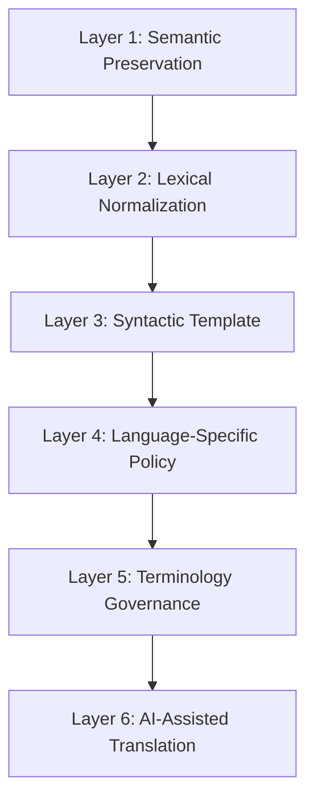

# Towards a SNOMED CT Translation Editorial Framework for AI-Assisted Translation

**Document status:** Draft for discussion  
**Version:** 0.1  
**Date:** June 2026  
**Audience:** National Release Centers (NRCs), SNOMED CT terminology authors, translation service providers, and designers of AI-assisted translation systems

---

## Abstract

The [SNOMED CT Editorial Guide](https://docs.snomed.org/snomed-ct-specifications/snomed-ct-editorial-guide) provides authoritative guidance for authoring concepts in the International Edition of SNOMED CT. It is written primarily as an English naming and modeling guide. This document reframes that guidance into a **language-independent translation editorial framework** that National Release Centers and machine-assisted translation systems can apply when producing target-language descriptions.

This framework is **not** a summary of the Editorial Guide. It extracts universal semantic principles, abstract linguistic patterns, and hierarchy-specific constraints, and proposes extensions for AI-assisted translation workflows. All proposed extensions are explicitly marked and do not represent existing SNOMED International policy.

---

## 1. Document scope and relationships

### 1.1 Purpose

This specification defines:

1. Universal semantic principles that should be preserved across all language translations.
2. Reusable abstract linguistic patterns derived from International Edition naming conventions.
3. Hierarchy-specific editorial constraints and translation risks.
4. A template for language-edition-specific policies that cannot be derived from the Editorial Guide alone.
5. A metadata model for AI-assisted translation.
6. A layered formal framework integrating the above.

### 1.2 Related specifications

| Document | Relationship |
|----------|--------------|
| [SNOMED CT Editorial Guide](https://docs.snomed.org/snomed-ct-specifications/snomed-ct-editorial-guide) | Primary source for Editorial Guide Derived rules |
| [Guidelines for Translation of SNOMED CT](https://docs.snomed.org) | Secondary reference for translation process and quality assessment |
| [Guidelines for Management of Translation of SNOMED CT](https://docs.snomed.org) | Secondary reference for NRC translation governance |
| Language Reference Sets (RF2) | Mechanism for preferred and acceptable descriptions per language/dialect |
| Pre-coordination Naming Patterns Project | Authoritative approved/disapproved surface patterns |

### 1.3 Non-goals

- This document does not replace the Editorial Guide for International Edition authoring.
- This document does not prescribe target-language translations or word-order mappings for specific languages.
- This document does not alter the status of the International FSN, which remains US English and serves as the linguistic meaning anchor for all editions.

### 1.4 Provenance conventions

Throughout this document, rules are tagged as follows:

- **[Editorial Guide Derived]** — Directly inferred from the SNOMED CT Editorial Guide. A source section reference is provided.
- **[Proposed Extension]** — New recommendation for AI-assisted translation or NRC policy definition. Not existing SNOMED International policy.

### 1.5 Notation

Abstract semantic templates use the following notation:

| Symbol | Meaning |
|--------|---------|
| `{Slot}` | Variable slot to be filled with a concept or term |
| `LOC(a, b)` | Locative relation: entity *a* at site *b* |
| `CAUSE(a, b)` | Causal relation: condition *a* caused by agent *b* |
| `PROC(action, site)` | Procedure: action performed on site |
| `SEP(role, site)` | Body structure SEP role (Structure, Entire, Part) |
| `OBS(property, component, site)` | Observable entity measurement pattern |
| `CTX(type, entity, context)` | Situation with explicit context |
| `QUAL(type, value)` | Qualifier value |
| `(semantic tag)` | Hierarchy disambiguator appended to FSN |

---

## 2. Universal semantic principles

Each principle below is documented with its rationale, illustrative examples (International Edition English surface forms), implications for AI-assisted translation, and provenance.

### 2.1 Semantic equivalence

**Rationale.** A translation must denote the same clinical concept as the source description. The International FSN is the primary linguistic anchor for meaning; the logical definition (concept model) must represent the same meaning. Synonyms that are narrower or broader than the FSN are not semantically equivalent and must not be produced as translations.

**Examples.**

- FSN `Removal of device (procedure)` must not be translated with a term equivalent to "Removal of prosthetic device," which is narrower.
- FSN `Sprain (morphologic abnormality)` must not be translated with a term equivalent to "Joint injury," which is broader.

**Implications for AI-assisted translation.** Translation output must be validated against the FSN meaning and concept model attributes, not against colloquial or dictionary equivalents alone. The system should flag candidate translations whose semantic scope differs from the source.

**Provenance.** [Editorial Guide Derived] — *Fully Specified Name*; *Synonym* (narrower/broader synonym rules).

---

### 2.2 Definitional scope preservation

**Rationale.** SNOMED CT concepts name **classes** of things, not individual instances. Translations must preserve class reference, singular semantics (unless the concept necessarily involves multiples), and must not introduce particular-instance references, precoordinated numeric ranges, or reason/indication qualifiers not present in the source concept.

**Examples.**

- `Doctor Jones pre-operative order set` is an instance, not a class, and is out of scope.
- FSNs must not include precoordinated numeric ranges or reference to a particular instance.

**Implications for AI-assisted translation.** The system must reject translations that pluralize a singular class concept, add patient-specific qualifiers, or introduce numeric thresholds not modeled in the source concept.

**Provenance.** [Editorial Guide Derived] — *Scope* (classes vs instances); *Fully Specified Name*; *Plurals*.

---

### 2.3 Concept orientation

**Rationale.** The hierarchy to which a concept belongs determines its clinical semantics. A disorder is necessarily an abnormal clinical state. Procedures are named as actions (noun forms), not as completed past events. Negation, refusal, and historical context belong in the Situation with explicit context hierarchy, not in disorder or procedure hierarchies.

**Examples.**

- Past tense `Hand tendon ganglion excised` is unacceptable for a procedure; acceptable form: `Excision of ganglion of tendon sheath of hand (procedure)`.
- `Body weight measurement declined (situation)` expresses refusal context; the associated finding is modeled separately.

**Implications for AI-assisted translation.** The semantic tag and top-level hierarchy must be supplied to the translation system. Translations must not reorient a procedure as a past-tense clinical statement or a negated finding as a disorder.

**Provenance.** [Editorial Guide Derived] — *Scope* (negation); *Action Verbs* (past tense); *Situation with Explicit Context Naming Conventions*.

---

### 2.4 Hierarchical consistency

**Rationale.** Foundation hierarchies (body structure, substance, organism, physical object, product) underpin naming in other hierarchies. When a disorder, procedure, or finding references a foundation entity, the naming conventions of that foundation hierarchy must be applied consistently in the translated term.

**Examples.**

- `Infection caused by Pseudomonas aeruginosa (disorder)` uses the organism description from the organism hierarchy.
- `Malignant neoplasm of lower lobe of right lung (disorder)` uses `lower lobe of right lung`, not `structure of lower lobe of right lung`.
- `Urinary bladder` must be used rather than `bladder` alone to distinguish from gallbladder.

**Implications for AI-assisted translation.** Foundation reference terms (organism names, anatomical sites, substances) should be translated using established translations from the same language edition's foundation concepts, not independently re-translated per occurrence.

**Provenance.** [Editorial Guide Derived] — *General Naming Conventions* (foundation hierarchies; structure/structure of rule).

---

### 2.5 Synonym management

**Rationale.** The FSN is unique among active descriptions. Synonyms need not be unique. Duplicate surface forms are permitted across hierarchies when the semantic tag disambiguates meaning. Within a single hierarchy, duplicate active descriptions in the same language indicate potential duplicate concepts.

**Examples.**

- `Abrasion` is acceptable as a preferred term in disorder, procedure, and morphologic abnormality hierarchies because semantic tags differ.
- `Intravascular large B-cell lymphoma` appears in both disorder and morphologic abnormality hierarchies with the same surface form.

**Implications for AI-assisted translation.** When translating a synonym, the system must preserve the description type intent (PT vs SYN) and must not assume uniqueness. Cross-hierarchy consistency of shared surface forms should be maintained where the same English term is shared.

**Provenance.** [Editorial Guide Derived] — *Synonym*; *Preferred Term*.

---

### 2.6 Ambiguity avoidance

**Rationale.** FSNs must be unambiguous. Ambiguous FSNs require concept inactivation. Homographs with multiple clinical meanings must be disambiguated through hierarchy, semantic tag, or additional qualifiers.

**Examples.**

- `Standing in water side toward (finding)` is ambiguous and unacceptable.
- `Immunosuppression` may mean a state or a procedure; the FSN must clarify which meaning is intended.

**Implications for AI-assisted translation.** The system should compare candidate translations against sibling concepts and flag homographs. Parent and sibling concept context should be supplied to disambiguate (e.g., `Weak e phenotype` vs `Weak E phenotype`).

**Provenance.** [Editorial Guide Derived] — *Fully Specified Name* (unambiguous requirement).

---

### 2.7 URU (Understandable, Reproducible, Useful)

**Rationale.** Content must be understandable without hidden meanings, reproducibly interpreted by multiple users, and demonstrably useful in healthcare. Translations must meet the same tests within the target language community.

**Examples.**

- A translation that is technically correct but not used by clinicians in the target locale fails the usefulness test.
- A translation that different experts interpret differently fails the reproducibility test.

**Implications for AI-assisted translation.** Human review by domain experts remains mandatory for acceptance. AI output should be treated as a draft for review, not as authoritative terminology.

**Provenance.** [Editorial Guide Derived] — *Scope* (Principle of URU).

---

### 2.8 Modifier and qualifier preservation

**Rationale.** Modeled attributes — including laterality, causative agent, method, severity, temporality, and disposition — are part of the concept definition. Translations must preserve all clinically relevant modifiers present in the source; none may be added or omitted.

**Examples.**

- `Inflammation of left mastoid (disorder)` requires preservation of laterality; PT may combine morpheme and site (`Left mastoiditis`) but must not drop laterality.
- `Infection caused by Clostridium tetani (disorder)` requires preservation of the causative organism.
- `-itis` suffix does not automatically imply infection unless the FSN states an infective cause.

**Implications for AI-assisted translation.** Concept model attributes should be extracted and supplied as mandatory translation slots. Validation should confirm each attribute slot is realized in the output.

**Provenance.** [Editorial Guide Derived] — *Lateralized Disorder Naming Conventions*; *Infectious vs Inflammatory*; concept model defining attributes.

---

### 2.9 Semantic tag fidelity

**Rationale.** Semantic tags in FSNs (e.g., `(disorder)`, `(procedure)`, `(substance)`) disambiguate concepts that share surface forms across hierarchies. Target-language translations may relocate or grammaticize the tag but must preserve the hierarchy identity it signals.

**Examples.**

- `(disorder)` vs `(finding)` vs `(situation)` distinguish clinically different concept types even when surface text overlaps.
- `(qualifier value)` distinguishes technique and disposition concepts from procedures and substances.

**Implications for AI-assisted translation.** The semantic tag must be included in translation metadata. Target-language editions may omit the tag from PT where clinical usage does not require it, consistent with International Edition PT conventions.

**Provenance.** [Editorial Guide Derived] — *Fully Specified Name*; *Synonym* (cross-hierarchy duplicates).

---

### 2.10 Pre-coordination boundary

**Rationale.** Excessive pre-coordination is discouraged. Only approved naming patterns should be translated as precoordinated terms. Naming conventions must not be driven by search or display word-order preferences; multiple word-order variants for these purposes are out of scope.

**Examples.**

- Approved patterns are catalogued in the Pre-coordination Naming Patterns Project.
- Situation hierarchy patterns such as `{measurement} declined (situation)` are approved; `Procedure offered` is no longer accepted.

**Implications for AI-assisted translation.** The system should identify the applicable approved pattern before generating a translation. Novel surface constructions not matching an approved pattern should be flagged for human review.

**Provenance.** [Editorial Guide Derived] — *Scope*; *General Naming Conventions*; *Situation with Explicit Context Naming Conventions*.

---

### 2.11 Machine-checkable equivalence criteria

**Rationale.** Automated translation validation requires objective checks beyond fluent rendering.

**Criteria.** [Proposed Extension]

A candidate translation should pass all of the following checks:

1. **Attribute set match** — All defining concept model attributes in the source concept are reflected in the translation slots.
2. **Parent concept consistency** — The translated term is consistent with the semantic category of its parent concept in the target language edition.
3. **No added qualifiers** — No clinical qualifier (laterality, severity, temporality, negation, agent) appears in the translation unless present in the source concept model.
4. **No removed qualifiers** — No modeled qualifier from the source is absent from the translation.
5. **Foundation term alignment** — Referenced organism, substance, and body structure terms match existing translations in the language edition.

**Provenance.** [Proposed Extension]

---

## 3. Reusable linguistic patterns

This section catalogues recurring naming constructions in the International Edition. Patterns are expressed as abstract templates. **No target-language translations are provided.** Translation guidance describes the semantic relation to preserve, not a specific rendering.

### 3.1 Cross-cutting lexical constraints

| Constraint | Abstract rule | Translation guidance |
|------------|---------------|---------------------|
| No articles | International FSNs omit `a`, `an`, `the` | [Editorial Guide Derived] Article policy is language-specific; see Section 4 |
| Locative preposition | `of` preferred over `in` for morphology in anatomic region | [Editorial Guide Derived] Map to target-language locative strategy; preserve region-not-layer semantics |
| Singular class | Descriptions name singular classes | [Editorial Guide Derived] Target grammar may require singular noun forms even where plural is colloquial |
| Action → noun | Procedures use `-tion`, `-sion`, `-ment`, root verb, or `-ing` | [Editorial Guide Derived] Realize procedural nominalization per language policy |
| No past tense procedures | Past tense → Situation hierarchy | [Editorial Guide Derived] Do not translate procedures as completed events |
| Noun phrases only | No imperative or declarative sentences | [Editorial Guide Derived] Target language must use nominal or equivalent constructions |

**Provenance.** [Editorial Guide Derived] — *General Naming Conventions*; *Action Verbs*; *Sentence Types*.

---

### 3.2 Pattern catalog

#### PAT-001: `{Morphology/Condition} of {Site}`

| Field | Value |
|-------|-------|
| English source pattern | `{Morphology/Condition} of {Site}` |
| Semantic meaning | Pathology or clinical state located in an anatomical region |
| Hierarchy | Clinical finding / disorder |
| Abstract template | `LOC(morphology, site)` |
| Translation guidance | Preserve locative relation and site specificity; laterality is part of `{Site}` when modeled; do not add "structure/structure of" |

**Examples (International Edition).** `Disorder of lung`, `Inflammation of left mastoid`, `Malignant neoplasm of lower lobe of right lung`

**Provenance.** [Editorial Guide Derived] — *General Naming Conventions*; *Lateralized Disorder Naming Conventions*; *Fully Specified Name*.

---

#### PAT-002: `{Condition} caused by {Agent}`

| Field | Value |
|-------|-------|
| English source pattern | `{Condition} caused by {Agent}` |
| Semantic meaning | Etiology explicitly stated |
| Hierarchy | Clinical finding / disorder |
| Abstract template | `CAUSE(condition, agent)` |
| Translation guidance | Preserve causality direction; `{Agent}` uses foundation organism/substance naming from the language edition |

**Examples.** `Infection caused by Pseudomonas aeruginosa (disorder)`, `Gingivitis caused by Candida (disorder)`

**Provenance.** [Editorial Guide Derived] — *General Naming Conventions*.

---

#### PAT-003: `{Condition} due to {Cause}`

| Field | Value |
|-------|-------|
| English source pattern | `{Condition} due to {Cause}` |
| Semantic meaning | Condition attributed to underlying cause (non-infective or general) |
| Hierarchy | Clinical finding / disorder |
| Abstract template | `CAUSE(condition, cause)` |
| Translation guidance | Distinguish from "caused by" only when the source FSN uses "due to"; do not interchange causality prepositions |

**Provenance.** [Editorial Guide Derived] — *Plurals* and disorder naming examples.

---

#### PAT-004: `{Neoplasm type} of {Site}`

| Field | Value |
|-------|-------|
| English source pattern | `{Neoplasm type} of {Site}` |
| Semantic meaning | Neoplastic morphology at anatomical site |
| Hierarchy | Clinical finding / disorder |
| Abstract template | `LOC(neoplasm_morphology, site)` |
| Translation guidance | Prefer "neoplasm" semantics over informal "tumor" unless PT convention dictates; preserve primary vs metastatic distinction |

**Examples.** `Primary malignant neoplasm of {site}`, `Benign neoplasm of clavicle (disorder)`

**Provenance.** [Editorial Guide Derived] — *Neoplasm* naming conventions.

---

#### PAT-005: `Metastatic malignant neoplasm to {Site}`

| Field | Value |
|-------|-------|
| English source pattern | `Metastatic malignant neoplasm to {Site}` |
| Semantic meaning | Metastatic spread to destination site |
| Hierarchy | Clinical finding / disorder |
| Abstract template | `LOC(metastasis, destination_site)` |
| Translation guidance | Use destination-oriented locative relation (`to`), not source-oriented (`from X to Y` precoordinated) |

**Provenance.** [Editorial Guide Derived] — *Neoplasm* naming conventions.

---

#### PAT-006: `{Action} of {Site}`

| Field | Value |
|-------|-------|
| English source pattern | `{Action} of {Site}` |
| Semantic meaning | Procedure performed on body structure |
| Hierarchy | Procedure |
| Abstract template | `PROC(action, site)` |
| Translation guidance | Use procedural noun/verbal noun per language policy; present-tense procedural semantics; omit "structure of" from site |

**Examples.** `Excision of colon`, `Incision of lung`, `Lobectomy of lower lobe of right lung`

**Provenance.** [Editorial Guide Derived] — *Excision, Incision, Biopsy*; *Action Verbs*; *Fully Specified Name*.

---

#### PAT-007: `{Modality} of {Site}`

| Field | Value |
|-------|-------|
| English source pattern | `{Modality} of {Site}` |
| Semantic meaning | Imaging or evaluation procedure using specified modality |
| Hierarchy | Procedure |
| Abstract template | `PROC(modality, site)` |
| Translation guidance | Modality may be abbreviated in PT per language policy; FSN-equivalent translation should expand modality unless edition policy permits otherwise |

**Examples.** FSN: `Computed tomography of head (procedure)`; PT: `CT of head`

**Provenance.** [Editorial Guide Derived] — *Computed Tomography*; *General Naming Conventions* (imaging acronyms).

---

#### PAT-008: `{Procedure} using {Modality} guidance`

| Field | Value |
|-------|-------|
| English source pattern | FSN: `{Procedure} using {Modality} guidance (procedure)` |
| Semantic meaning | Procedure performed with imaging or other guidance |
| Hierarchy | Procedure |
| Abstract template | `PROC(procedure, guidance=modality)` |
| Translation guidance | FSN and PT may use different word orders (`{Modality} guided {procedure}` in PT); this inversion is English-specific and must not be assumed universal |

**Provenance.** [Editorial Guide Derived] — *Imaging Guided Procedure Naming*.

---

#### PAT-009: `{Structure/Entire/Part} of {Site}` (SEP model)

| Field | Value |
|-------|-------|
| English source pattern | `{X} structure` / `Structure of {X}` / `Entire {X}` / `{X} part` / `Part of {X}` |
| Semantic meaning | Anatomical entity with specified SEP role |
| Hierarchy | Body structure |
| Abstract template | `SEP(role ∈ {S, E, P}, site)` |
| Translation guidance | Must distinguish Structure, Entire, and Part roles; PT may omit "structure" but translation must not conflate roles |

**Examples.**

| FSN | PT | Role |
|-----|-----|------|
| `Liver structure (body structure)` | `Liver structure` | S |
| `Entire liver (body structure)` | `Entire liver` | E |
| `Liver part (body structure)` | — | P |

**Provenance.** [Editorial Guide Derived] — *Naming Convention for SEP Model*.

---

#### PAT-010: `{Property} of {Component} in {Site}` (Observable entity)

| Field | Value |
|-------|-------|
| English source pattern | `{Property}, {Component}, {Direct Site}` with optional `(Scale Method, Property)` and `(Time aspect, Direct Site)` modifiers |
| Semantic meaning | Observable property of a component at a direct site |
| Hierarchy | Observable entity |
| Abstract template | `OBS(property, component, site)` |
| Translation guidance | Property-Component-Site order is English FSN order; reorder per target-language clinical convention while preserving all three semantic roles |

**Examples.** `Concentration of hemoglobin in erythrocyte (observable entity)`

**Provenance.** [Editorial Guide Derived] — *Observable Entity Naming Conventions*.

---

#### PAT-011: `{Measurement} by screening method`

| Field | Value |
|-------|-------|
| English source pattern | `{Measurement} ... by screening method` |
| Semantic meaning | Screening measurement |
| Hierarchy | Observable entity |
| Abstract template | `OBS(property, component, site, method=screening)` |
| Translation guidance | Append screening method modifier at end per language word-order policy |

**Provenance.** [Editorial Guide Derived] — *Observable Entity Naming Conventions*.

---

#### PAT-012: `{Release} {Route/Site} {Basic form} (dose form)`

| Field | Value |
|-------|-------|
| English source pattern | `{Release characteristic} {intended site} {basic dose form} (dose form)` |
| Semantic meaning | Pharmaceutical dose form specification |
| Hierarchy | Pharmaceutical / biologic product |
| Abstract template | `DOSEFORM(release, site, basic_form)` |
| Translation guidance | Multi-site values in alphabetical order joined by `and` in English FSN; PT omits default "conventional release" — this omission is English PT convention, not a universal rule |

**Examples.** FSN: `Conventional release oral capsule (dose form)`; PT: `Oral capsule`

**Provenance.** [Editorial Guide Derived] — *Pharmaceutical Dose Form Naming and Modeling Conventions*.

---

#### PAT-013: `Product containing only {Ingredient(s)} (medicinal product)`

| Field | Value |
|-------|-------|
| English source pattern | `Product containing only {Ingredient(s)} (medicinal product)` |
| Semantic meaning | Medicinal product defined by ingredient set |
| Hierarchy | Pharmaceutical / biologic product |
| Abstract template | `PROD(containing=only, ingredients[])` |
| Translation guidance | Ingredients follow INN naming; multi-ingredient lists in alphabetical order with `and` in English FSN; no strength or dose form |

**Provenance.** [Editorial Guide Derived] — *Medicinal Product containing only*.

---

#### PAT-014: `{Entity} declined (situation)`

| Field | Value |
|-------|-------|
| English source pattern | `{Finding/Procedure/Measurement} declined (situation)` |
| Semantic meaning | Explicit refusal or non-performance context |
| Hierarchy | Situation with explicit context |
| Abstract template | `CTX(declined, entity, context=refusal)` |
| Translation guidance | PT may shorten to `declined`; optional SYN for `refused`; do not translate as a disorder or negated finding |

**Examples.** `Body weight measurement declined (situation)`

**Provenance.** [Editorial Guide Derived] — *Situation with Explicit Context Naming Conventions*.

---

#### PAT-015: `No known {X} (situation)`

| Field | Value |
|-------|-------|
| English source pattern | `No known {X} (situation)` |
| Semantic meaning | Absence of known condition/allergy in subject context |
| Hierarchy | Situation with explicit context |
| Abstract template | `CTX(no_known, entity, context=subject)` |
| Translation guidance | Preserve "no known" semantics; acronym SYN may follow edition policy (e.g., `NKA - No known allergy`) |

**Provenance.** [Editorial Guide Derived] — *Situation with Explicit Context Naming Conventions*.

---

#### PAT-016: `Past pregnancy history of {X} (situation)`

| Field | Value |
|-------|-------|
| English source pattern | `Past pregnancy history of {X} (situation)` |
| Semantic meaning | Subject's past pregnancy history, distinct from family history |
| Hierarchy | Situation with explicit context |
| Abstract template | `CTX(past_pregnancy_history, entity, subject=record_subject)` |
| Translation guidance | Must distinguish from family history of same finding |

**Provenance.** [Editorial Guide Derived] — *Situation with Explicit Context Naming Conventions*.

---

#### PAT-017: `{X} (disposition)`

| Field | Value |
|-------|-------|
| English source pattern | `{X} (disposition)` |
| Semantic meaning | Functional disposition attributed to substances |
| Hierarchy | Qualifier value (disposition) |
| Abstract template | `QUAL(disposition, value)` |
| Translation guidance | PT omits semantic tag; do not translate as a standalone substance or finding |

**Examples.** FSN: `Coagulation factor inhibitor (disposition)`; PT: `Coagulation factor inhibitor`

**Provenance.** [Editorial Guide Derived] — *Disposition*.

---

#### PAT-018: `{X} technique (qualifier value)`

| Field | Value |
|-------|-------|
| English source pattern | `{X} technique (qualifier value)` |
| Semantic meaning | Method by which an observation was made |
| Hierarchy | Qualifier value (technique) |
| Abstract template | `QUAL(technique, value)` |
| Translation guidance | Describes *how* something was observed; not a procedure concept; must include "technique" in FSN-equivalent translation unless PT shortening policy applies |

**Examples.** `Microbial culture technique (qualifier value)`

**Provenance.** [Editorial Guide Derived] — *Disposition* (technique modeling note); *Technique*.

---

#### PAT-019: `{Rank} {Scientific name} (organism)`

| Field | Value |
|-------|-------|
| English source pattern | `{Rank} {Scientific name} (organism)` |
| Semantic meaning | Taxonomic organism class |
| Hierarchy | Organism |
| Abstract template | `ORG(rank, scientific_name)` |
| Translation guidance | Scientific names are international; preserve Latin binomial; PT may abbreviate rank (`subsp.`); capitalization follows authoritative nomenclature |

**Provenance.** [Editorial Guide Derived] — *Organism Naming Conventions*.

---

#### PAT-020: `{Life cycle stage} of {Taxon} (organism)` / `{Taxon} {Life cycle stage}`

| Field | Value |
|-------|-------|
| English source pattern | FSN: `(Life cycle stage) of (Taxon) (organism)`; PT: `(Taxon) (life cycle stage)` |
| Semantic meaning | Organism at specified life stage |
| Hierarchy | Organism |
| Abstract template | `ORG(life_stage, taxon)` |
| Translation guidance | FSN and PT use inverted constituent order in English; target language may use a single canonical order per edition policy |

**Provenance.** [Editorial Guide Derived] — *Organism Naming Conventions*.

---

#### PAT-021: `{INN substance name} (substance)`

| Field | Value |
|-------|-------|
| English source pattern | `{INN-aligned name} (substance)` |
| Semantic meaning | Chemical/biological substance class |
| Hierarchy | Substance |
| Abstract template | `SUBST(name, modifiers=[])` |
| Translation guidance | FSN aligned with INN; no strength, dose form, or use-case descriptors; singular form; protein/gene symbols follow International Protein Nomenclature |

**Provenance.** [Editorial Guide Derived] — *Substance General Guidelines*.

---

#### PAT-022: Lateralized `{Condition/Action} of {left/right} {Site}`

| Field | Value |
|-------|-------|
| English source pattern | FSN: `{Condition/Action} of left/right {Site}`; PT may combine: `Left/Right {combined term}` |
| Semantic meaning | Laterality-specific disorder or procedure |
| Hierarchy | Disorder / procedure |
| Abstract template | `LAT(side ∈ {left, right}, entity, site)` |
| Translation guidance | Laterality must be preserved; PT combined forms (e.g., `Left mastoiditis`) are English-specific and require language-specific policy; create non-lateralized parent consistency |

**Provenance.** [Editorial Guide Derived] — *Lateralized Disorder Naming Conventions*; *Lateralized Procedure Naming Conventions*.

---

#### PAT-023: Bilateral `{Condition/Action} of bilateral {Sites}`

| Field | Value |
|-------|-------|
| English source pattern | `{Condition/Action} of bilateral {Sites}`; PT: `Bilateral {combined}` or repeat FSN pattern |
| Semantic meaning | Both sides affected |
| Hierarchy | Disorder / procedure |
| Abstract template | `LAT(side=bilateral, entity, sites)` |
| Translation guidance | Singular joint with plural feet pattern in English (`Effusion of joint of bilateral feet`); do not pluralize site elements incorrectly; "both" may be acceptable SYN |

**Provenance.** [Editorial Guide Derived] — *Lateralized Disorder Naming Conventions*; *Lateralized Procedure Naming Conventions*.

---

## 4. Hierarchy-specific editorial rules

For each major hierarchy, this section documents common linguistic patterns, terminology conventions, semantic constraints, and translation risks.

### 4.1 Clinical finding and disorder

**Common linguistic patterns.**

- `LOC(morphology/condition, site)` — primary disorder pattern (PAT-001).
- `CAUSE(condition, agent)` — infectious and causative disorders (PAT-002).
- Lateralized and bilateral patterns (PAT-022, PAT-023).
- Neoplasm patterns (PAT-004, PAT-005).
- Combined morpheme-site PT forms when natural in English (e.g., `Left mastoiditis`).

**Terminology conventions.**

- Disorder FSNs include `(disorder)` or `(finding)` semantic tag.
- `-itis` does not automatically imply infection; infective cause must be explicit in FSN and modeled.
- Overlapping neoplasm sites include "overlapping sites" in FSN/PT.
- No "structure" or "structure of" in disorder descriptions.

**Semantic constraints.**

- A disorder is always an abnormal clinical state.
- Unilateral unspecified concepts are not accepted.
- Non-lateralized parent must exist when lateralized children are created.

**Translation risks.**

| Risk | Mitigation |
|------|------------|
| Assuming `-itis` implies infection | Check FSN and modeled causative agent |
| Dropping laterality in combined PT forms | Validate laterality slot explicitly |
| Conflating metastatic `to` vs primary `of` | Apply PAT-004 vs PAT-005 |
| Translating negated findings as disorders | Route to Situation hierarchy |
| Using "structure of" in site phrases | Strip structure words outside body structure hierarchy |

**Provenance.** [Editorial Guide Derived] — *Lateralized Disorder Naming Conventions*; *Neoplasm*; *Infectious vs Inflammatory*; *Clinical finding and Disorder Modeling*.

---

### 4.2 Procedure

**Common linguistic patterns.**

- `PROC(action, site)` (PAT-006).
- Imaging modality patterns (PAT-007, PAT-008).
- Lateralized and bilateral patterns (PAT-022, PAT-023).
- Action verbs in noun form per *Action Verbs*.

**Terminology conventions.**

- Procedures in present tense; noun phrases only.
- FSN includes `(procedure)` semantic tag.
- Eponymous synonyms encouraged for common procedures (e.g., `Whipple procedure`); FSN should be non-eponymous.
- Imaging PT may use acronyms without expansion.

**Semantic constraints.**

- Past tense indicates completed action → Situation hierarchy, not procedure.
- Reason or indication for procedure not included in FSN unless it directly impacts method.
- Bilateral procedures modeled with two relationship groups.

**Translation risks.**

| Risk | Mitigation |
|------|------------|
| Past tense translation | Validate against PAT-006; reject past tense |
| Method vs site confusion in guided procedures | Apply PAT-008 metadata |
| Eponym in FSN-equivalent translation | FSN policy: non-eponymous; eponym in SYN only |
| Translating "repair" as invalid nominalization | Accept established exceptions per language policy |

**Provenance.** [Editorial Guide Derived] — *Action Verbs*; *Lateralized Procedure Naming Conventions*; *Excision, Incision, Biopsy*; *General Naming Conventions* (eponyms).

---

### 4.3 Body structure

**Common linguistic patterns.**

- SEP model patterns (PAT-009).
- `Structure of left/right {site}` for lateralized structures.
- Specific digit/hand/foot naming: `Structure of finger of left hand`, not `Structure of left finger`.

**Terminology conventions.**

- FSN must include `structure`, `entire`, or `part`.
- All Entire concept descriptions must contain `Entire`.
- `structure` may be omitted in synonyms.
- Context-neutral naming for foundation concepts.

**Semantic constraints.**

- S, E, and P roles are semantically distinct and must not be conflated.
- Laterality follows body structure hierarchy conventions.

**Translation risks.**

| Risk | Mitigation |
|------|------------|
| Conflating S/E/P roles | Validate SEP role from concept model |
| Over-general laterality (`left finger`) | Use full site chain from source |
| Adding "structure" in non-body-structure hierarchies | Strip when translating referenced sites |

**Provenance.** [Editorial Guide Derived] — *Naming Convention for SEP Model*; *Laterality*.

---

### 4.4 Observable entity

**Common linguistic patterns.**

- Property-Component-Site order (PAT-010).
- Scale Method precedes Property when present.
- Time aspect precedes Direct Site when present.
- Screening suffix (PAT-011).

**Terminology conventions.**

- FSN includes `(observable entity)` semantic tag.
- `serology` and `serologic test` must not appear in FSNs.
- Screening measurements append `by screening method`.

**Semantic constraints.**

- Observable entities describe what can be observed, not procedures that observe them.
- Same surface form may appear in observable entity and procedure hierarchies (semantic tag disambiguates).

**Translation risks.**

| Risk | Mitigation |
|------|------------|
| Treating English word order as universal | Reorder per language policy; preserve semantic roles |
| Translating as procedure | Check semantic tag and hierarchy |
| Including ambiguous serology terms in FSN-equivalent form | Flag and reject |

**Provenance.** [Editorial Guide Derived] — *Observable Entity Naming Conventions*; *Observable Entity Templates*.

---

### 4.5 Pharmaceutical and biologic product

**Common linguistic patterns.**

- Dose form pattern (PAT-012).
- Medicinal product containing only (PAT-013).
- Multi-value alphabetical ordering with `and`.

**Terminology conventions.**

- FSN includes dose form or medicinal product semantic tag.
- PT omits default "conventional release" in English.
- Synonyms with lay anatomical terms (`eye`/`otic`/`nasal`) permitted as exceptions.

**Semantic constraints.**

- No strength in substance or unscoped product names.
- Lyophilized dose forms out of scope for International Edition.

**Translation risks.**

| Risk | Mitigation |
|------|------------|
| Adding strength or dose not in source | Validate against concept model |
| Non-alphabetical multi-ingredient order | Preserve ingredient set; ordering may be language-specific if all ingredients present |
| Omitting release characteristic when non-default | Check release attribute value |

**Provenance.** [Editorial Guide Derived] — *Pharmaceutical Dose Form Naming and Modeling Conventions*; *Medicinal Product containing only*.

---

### 4.6 Situation with explicit context

**Common linguistic patterns.**

- Declined/refused (PAT-014).
- No known X (PAT-015).
- Past pregnancy history (PAT-016).
- History concepts using `History of` with procedure context attribute.

**Terminology conventions.**

- FSN includes `(situation)` semantic tag.
- `Procedure offered`, `Procedure not offered`, `Procedure done`, `Procedure not done` are no longer accepted for new International Edition content.

**Semantic constraints.**

- Context attributes (associated finding/procedure, finding/procedure context, subject, temporal context) define meaning.
- Must distinguish subject history from family history.

**Translation risks.**

| Risk | Mitigation |
|------|------------|
| Translating as simple negated finding | Apply situation context model |
| Conflating past pregnancy history with family history | Validate subject context |
| Using disallowed procedure-offered patterns | Check against approved pattern list |

**Provenance.** [Editorial Guide Derived] — *Situation with Explicit Context Naming Conventions*; *Situation with Explicit Context Modeling*.

---

### 4.7 Qualifier value

**Common linguistic patterns.**

- Disposition (PAT-017).
- Technique (PAT-018).

**Terminology conventions.**

- FSN includes `(qualifier value)` or `(disposition)` semantic tag.
- Technique FSNs include the word `technique`.

**Semantic constraints.**

- Qualifier values describe attributes of observations; they are not standalone clinical findings, substances, or procedures.
- Same surface form may appear in qualifier value and other hierarchies (e.g., `Acid fast stain`).

**Translation risks.**

| Risk | Mitigation |
|------|------------|
| Translating as procedure or substance | Validate semantic tag |
| Omitting "technique" from FSN-equivalent form | Apply PAT-018 |
| PT shortening that loses disposition meaning | Review against parent disposition concept |

**Provenance.** [Editorial Guide Derived] — *Disposition*; *Technique*; *Synonym* (cross-hierarchy examples).

---

### 4.8 Organism

**Common linguistic patterns.**

- Taxonomic naming (PAT-019).
- Life cycle stage patterns (PAT-020).

**Terminology conventions.**

- FSN: expanded rank, no parentheses or abbreviations in FSN.
- PT: official scientific name; may abbreviate (`subsp.`).
- Genus capitalized; species epithet lower case; rank not capitalized.
- When organism appears in other hierarchies: capitalize when species specified; lowercase when referring to disease name.

**Semantic constraints.**

- Taxonomic rank not included when organism referenced in non-organism hierarchies.
- Names follow authoritative resources (LPSN, ICTV, ITIS, etc.).

**Translation risks.**

| Risk | Mitigation |
|------|------------|
| Translating scientific names | Preserve Latin binomial; common names per edition policy |
| Incorrect capitalization in disease vs organism reference | Apply organism-in-context rules |
| FSN/PT life stage order mismatch | Follow edition policy for canonical order |

**Provenance.** [Editorial Guide Derived] — *Organism Naming Conventions*; *Case Significance*.

---

### 4.9 Substance

**Common linguistic patterns.**

- INN-aligned naming (PAT-021).
- Protein and enzyme naming conventions.
- Allergen nomenclature (WHO/IUIS pattern).

**Terminology conventions.**

- FSN aligned with INN; PT aligned with USAN/BAN.
- Singular descriptions; no strength, dose form, or use-case descriptors.
- Greek letters case insensitive in substance hierarchy.
- Isomer prefixes (`levo`, `dextro`) expanded in FSN and PT.

**Semantic constraints.**

- Manufacturer-specific prefixes/suffixes (FDA) not used; INN used.
- Changes to substance descriptions may impact medicinal product terming.

**Translation risks.**

| Risk | Mitigation |
|------|------------|
| Adding strength or pharmaceutical form | Reject; not in scope for substance |
| Translating INN names | INN is international; use official INN form |
| Incorrect protein symbol casing | Apply case significance rules |
| Appending "protein" to enzyme names | Follow protein nomenclature guidelines |

**Provenance.** [Editorial Guide Derived] — *Substance General Guidelines*; *General Naming Conventions* (protein symbols).

---

## 5. Language-specific policy template

**[Proposed Extension]** — The following template defines decisions that cannot be derived from the Editorial Guide and must be completed by each language edition. NRCs should publish a completed policy record alongside their Language RefSet.

### 5.1 Policy template structure

For each section, the NRC completes: **Policy statement**, **Rationale**, **Examples** (in the target language), and **Exceptions**.

---

#### 5.1.1 Capitalization and case significance

| Item | NRC completes |
|------|---------------|
| Policy statement | How `ci`, `cI`, and `CS` map to target-language orthographic rules |
| Rationale | Whether target language uses initial-cap convention |
| Examples | Terms where case carries meaning (e.g., blood group phenotypes) |
| Exceptions | Assessment scales, eponyms, scientific names |

---

#### 5.1.2 Article usage

| Item | NRC completes |
|------|---------------|
| Policy statement | Whether descriptions include definite/indefinite articles |
| Rationale | Clinical usage and grammar requirements |
| Examples | PT forms with and without articles |
| Exceptions | Fixed phrases, borrowed terms |

---

#### 5.1.3 Anatomical naming conventions

| Item | NRC completes |
|------|---------------|
| Policy statement | Lay vs technical anatomical terms; Latin form usage |
| Rationale | National clinical practice and education standards |
| Examples | Preferred anatomical terms for major body regions |
| Exceptions | Eponymous anatomical structures |

---

#### 5.1.4 Eponym handling

| Item | NRC completes |
|------|---------------|
| Policy statement | When eponyms appear in PT vs SYN; FSN-equivalent non-eponymous requirement |
| Rationale | National clinical usage |
| Examples | Eponymous and non-eponymous pairs |
| Exceptions | Eponym-only precise names (e.g., Hodgkin lymphoma) |

---

#### 5.1.5 Acronym and abbreviation policy

| Item | NRC completes |
|------|---------------|
| Policy statement | Expansion format; imaging acronym PT shortcuts; organism abbreviations |
| Rationale | Readability vs clinical brevity |
| Examples | `ACR - expanded term` vs inline parenthetical expansion |
| Exceptions | INN, gene/protein symbols, established clinical acronyms |

---

#### 5.1.6 Grammatical gender and agreement

| Item | NRC completes |
|------|---------------|
| Policy statement | Gender assignment for anatomical and clinical terms; adjective/participle agreement rules |
| Rationale | Target language grammar |
| Examples | Agreement patterns for disorder and procedure terms |
| Exceptions | Invariable borrowed terms |

---

#### 5.1.7 Word order strategies per template type

| Item | NRC completes |
|------|---------------|
| Policy statement | Canonical word order for each pattern ID (PAT-001 through PAT-023) |
| Rationale | National clinical phrasing conventions |
| Examples | Reordered realization of Property-Component-Site and locative patterns |
| Exceptions | Fixed international terms (INN, Latin binomials) |

---

#### 5.1.8 Pluralization

| Item | NRC completes |
|------|---------------|
| Policy statement | When singular FSN semantics require plural PT forms |
| Rationale | Clinical usage (e.g., bilateral body sites) |
| Examples | Singular class vs plural clinical PT |
| Exceptions | Invariant scientific names |

---

#### 5.1.9 Dialect variants

| Item | NRC completes |
|------|---------------|
| Policy statement | Multiple Language RefSets per language; dialect-specific PT rules |
| Rationale | Regional clinical practice (analogous to US vs GB English) |
| Examples | Dialect variant pairs |
| Exceptions | Shared international scientific terms |

---

#### 5.1.10 Local clinical terminology preferences

| Item | NRC completes |
|------|---------------|
| Policy statement | Alignment with national classifications (ICD, national formularies) |
| Rationale | Interoperability with national health systems |
| Examples | Preferred national terms for common concepts |
| Exceptions | Where SNOMED International FSN meaning must override local preference |

---

#### 5.1.11 Borrowing vs calque policy

| Item | NRC completes |
|------|---------------|
| Policy statement | When to borrow international terms vs construct calques |
| Rationale | Understandability and reproducibility in target locale |
| Examples | Borrowed INN vs translated descriptive terms |
| Exceptions | Organism scientific names, protein symbols |

---

#### 5.1.12 Description-type realization rules

| Item | NRC completes |
|------|---------------|
| Policy statement | When PT may shorten FSN; when FSN fidelity is required |
| Rationale | Clinical usability vs semantic precision |
| Examples | PT omitting semantic tag, release characteristic, or "structure" |
| Exceptions | Concepts where shortening causes ambiguity |

---

### 5.2 Machine-readable policy record schema

**[Proposed Extension]**

```yaml
languageEditionPolicy:
  editionId: "<codesystem-module-id>"
  languageCode: "<ISO 639-1>"
  refsetId: "<language-refset-id>"
  version: "1.0.0"
  effectiveDate: "YYYY-MM-DD"

  capitalization:
    initialCapConvention: true | false
    caseSignificanceMapping:
      ci: "<target rule description>"
      cI: "<target rule description>"
      CS: "<target rule description>"
    exceptions: []

  articles:
    policy: none | definite | indefinite | context-dependent
    exceptions: []

  anatomicalNaming:
    preferredTerminology: lay | technical | mixed
    latinForms: permitted | discouraged | required-for-FSN
    exceptions: []

  eponyms:
    fsnNonEponymous: required
    ptEponymPermitted: true | false
    synonymEponymPermitted: true | false
    apostropheRules: "<description>"
    exceptions: []

  acronyms:
    standaloneFormat: "ACR - expanded" | "ACR (expanded)" | custom
    imagingPtShortcut: permitted | not-permitted
    organismAbbreviations: per-authoritative-source | expanded-always
    exceptions: []

  genderAgreement:
    applicable: true | false
    rules: "<description>"
    exceptions: []

  wordOrder:
    patterns:
      PAT-001: "<canonical order description>"
      PAT-010: "<canonical order description>"
      # ... one entry per applicable pattern

  pluralization:
    fsnSingularRequired: true
    ptPluralPermitted: true | false
    rules: "<description>"

  dialects:
    - refsetId: "<dialect-refset-id>"
      name: "<dialect name>"
      overrides: {}

  localTerminology:
    classificationAlignment: "<ICD/national classification reference>"
    preferredTerms: {}

  borrowingPolicy:
    inn: borrow
    organismScientificName: borrow
    proteinSymbols: borrow
    clinicalTerms: borrow | calque | mixed

  descriptionTypeRules:
    ptMayOmitSemanticTag: true | false
    ptMayOmitStructure: true | false
    ptMayOmitDefaultRelease: true | false
    fsnFidelityRequired: true
```

---

## 6. AI translation guidance model

**[Proposed Extension]** — This section defines metadata that should accompany each source term presented to an AI translation system.

### 6.1 Translation context record

| Field | Source | Required | Purpose |
|-------|--------|----------|---------|
| `conceptId` | RF2 | Yes | Stable concept identity |
| `descriptionId` | RF2 | Yes | Source description identity |
| `sourceTerm` | RF2 | Yes | English term to translate |
| `descriptionType` | RF2 | Yes | FSN, PT, or SYN — governs fidelity vs fluency |
| `semanticTag` | Parsed from FSN | Yes | Hierarchy disambiguation |
| `topLevelHierarchy` | Taxonomy | Yes | Selects hierarchy rules (Section 4) |
| `conceptModelAttributes` | MRCM / terminology server | Yes | Defining slots to preserve |
| `parentConcepts` | Taxonomy | Recommended | Semantic context |
| `siblingConcepts` | Taxonomy | Recommended | Homograph disambiguation |
| `foundationReferences` | Concept model | Recommended | Consistent organism/substance/site naming |
| `preferredPatternId` | PAT-001–PAT-023 | Recommended | Template selection (Section 3) |
| `existingTranslations` | Language RefSet | Recommended | Terminological consistency anchor |
| `goldenExamples` | NRC policy | Recommended | Few-shot alignment examples |
| `languagePolicyRef` | Section 5 policy record | Yes | Edition-specific rules |
| `caseSignificance` | RF2 | Yes | Orthographic sensitivity |
| `acceptabilityTarget` | Translation intent | Yes | PT vs acceptable synonym intent |
| `lateralized` | Concept model | When applicable | Laterality preservation |
| `approvedPatternStatus` | Pre-coordination Naming Patterns | Recommended | Approved / unapproved / legacy |

### 6.2 Context utilization

**Template-first prompting.** The AI system should:

1. Identify the applicable pattern (Section 3) from `preferredPatternId` and hierarchy.
2. Extract semantic slots from `conceptModelAttributes` and `sourceTerm`.
3. Retrieve existing translations for `foundationReferences` and `siblingConcepts`.
4. Apply `languagePolicyRef` for surface realization.
5. Generate candidate translation(s).
6. Validate against Section 2 principles and Section 6.3 gates.

**Retrieval-augmented consistency.** Supplying `parentConcepts`, `siblingConcepts`, and `existingTranslations` reduces inconsistent rendering of shared foundation terms and helps disambiguate homographs.

**Golden examples.** NRC-provided `goldenExamples` (source term → approved translation pairs) align output with edition-specific conventions without encoding those conventions in the model weights.

### 6.3 Validation gates

**[Proposed Extension]**

| Gate | Check |
|------|-------|
| G1 Attribute preservation | All `conceptModelAttributes` slots present in output |
| G2 Pattern conformance | Output matches `preferredPatternId` word-order policy |
| G3 Foundation alignment | Referenced foundation terms match `existingTranslations` |
| G4 Semantic scope | No narrower/broader synonym produced |
| G5 Hierarchy orientation | No past-tense procedure; no negated disorder where situation required |
| G6 Duplicate detection | No unintended duplicate within hierarchy/language |
| G7 Ambiguity flag | Homograph detected against `siblingConcepts` |
| G8 Case significance | Output conforms to `caseSignificance` and language policy |
| G9 Description type | PT shortening rules applied per `languagePolicyRef` |

### 6.4 Human review workflow

AI-generated translations should enter a **for review** state before acceptance into a Language RefSet. Reviewers validate URU criteria, clinical acceptability, and consistency with golden examples. This workflow aligns with established translation quality assessment practices described in SNOMED International translation guidelines but does not prescribe a specific tooling implementation.

**Provenance.** [Proposed Extension]

---

## 7. Formal framework — six layers

This section integrates Sections 2–6 into a layered architecture. Each layer specifies purpose, rules, examples, and implementation considerations.



---

### Layer 1: Semantic Preservation Rules

**Purpose.** Ensure the translated term denotes the same clinical concept as the International Edition source, independent of target-language surface form.

**Rules.**

| ID | Rule | Provenance |
|----|------|------------|
| L1-R01 | Translation must be semantically equivalent to the International FSN | [Editorial Guide Derived] |
| L1-R02 | All concept model defining attributes must be preserved | [Editorial Guide Derived] |
| L1-R03 | Concept class (not instance) semantics must be preserved | [Editorial Guide Derived] |
| L1-R04 | Hierarchy orientation must be preserved (disorder vs situation vs procedure) | [Editorial Guide Derived] |
| L1-R05 | Semantic tag identity must be preserved | [Editorial Guide Derived] |
| L1-R06 | Machine-checkable equivalence criteria (Section 2.11) must pass | [Proposed Extension] |

**Examples.** A translation of `Inflammation of left mastoid (disorder)` must preserve inflammation morphology, mastoid site, and left laterality.

**Implementation considerations.** Requires terminology server access to concept model attributes and taxonomy. Validation is hierarchy-aware.

---

### Layer 2: Lexical Normalization Rules

**Purpose.** Ensure consistent rendering of international lexical entities and foundation hierarchy references across all translations within a language edition.

**Rules.**

| ID | Rule | Provenance |
|----|------|------------|
| L2-R01 | INN substance names used without manufacturer-specific prefixes/suffixes | [Editorial Guide Derived] |
| L2-R02 | Organism scientific names follow authoritative nomenclature | [Editorial Guide Derived] |
| L2-R03 | Foundation hierarchy terms referenced in non-foundation hierarchies use established edition translations | [Editorial Guide Derived] |
| L2-R04 | Protein and gene symbols follow International Protein Nomenclature | [Editorial Guide Derived] |
| L2-R05 | Acronym expansion format follows language policy (Section 5) | [Proposed Extension] |
| L2-R06 | Foundation term glossary maintained per language edition for AI retrieval | [Proposed Extension] |

**Examples.** If `Pseudomonas aeruginosa` is translated as term *T* in the organism hierarchy, all disorder translations referencing that organism must use *T*.

**Implementation considerations.** Maintain a foundation term translation index. AI systems should retrieve rather than re-translate foundation references.

---

### Layer 3: Syntactic Template Rules

**Purpose.** Apply abstract naming patterns (Section 3) to produce structurally correct target-language descriptions.

**Rules.**

| ID | Rule | Provenance |
|----|------|------------|
| L3-R01 | Identify applicable pattern from PAT-001–PAT-023 before translation | [Editorial Guide Derived] / [Proposed Extension] |
| L3-R02 | Preserve semantic slot fill content regardless of surface word order | [Editorial Guide Derived] |
| L3-R03 | Do not treat English FSN word order as universal | [Editorial Guide Derived] |
| L3-R04 | Apply lateralized and bilateral patterns per hierarchy rules | [Editorial Guide Derived] |
| L3-R05 | Reject outputs matching unapproved or deprecated patterns | [Editorial Guide Derived] |
| L3-R06 | Pattern registry (Appendix B) maintained as machine-readable catalog | [Proposed Extension] |

**Examples.** PAT-010 (`OBS(property, component, site)`) permits reordering in target language but requires all three roles to be present.

**Implementation considerations.** Pattern identification may use rule-based parsing of English FSN combined with concept model attribute types.

---

### Layer 4: Language-Specific Policies

**Purpose.** Apply NRC-defined policies (Section 5) for target-language surface realization.

**Rules.**

| ID | Rule | Provenance |
|----|------|------------|
| L4-R01 | Each language edition must publish a completed policy record (Section 5.2) | [Proposed Extension] |
| L4-R02 | Capitalization follows mapped case significance rules | [Editorial Guide Derived] / [Proposed Extension] |
| L4-R03 | Article, gender, pluralization, and word order follow edition policy | [Proposed Extension] |
| L4-R04 | Dialect variants managed through separate Language RefSets | [Editorial Guide Derived] |
| L4-R05 | Description-type shortening (PT vs FSN fidelity) follows edition policy | [Editorial Guide Derived] / [Proposed Extension] |

**Examples.** An edition may permit PT forms that omit `(disorder)` and "structure" where English does, but must document this in its policy record.

**Implementation considerations.** Policy record loaded as configuration for AI prompt assembly and post-generation validation.

---

### Layer 5: Terminology Governance Rules

**Purpose.** Govern acceptance, change control, and quality assurance of translated descriptions within a language edition.

**Rules.**

| ID | Rule | Provenance |
|----|------|------------|
| L5-R01 | FSN in International Edition is immutable by translation process | [Editorial Guide Derived] |
| L5-R02 | Translations published through Language RefSets with acceptability flags | [Editorial Guide Derived] |
| L5-R03 | Narrower/broader synonyms inactivated with `Not semantically equivalent component` | [Editorial Guide Derived] |
| L5-R04 | Duplicate descriptions within same hierarchy/language investigated for duplicate concepts | [Editorial Guide Derived] |
| L5-R05 | Translation quality assessment per SNOMED International translation guidelines | [Editorial Guide Derived] / [Proposed Extension] |
| L5-R06 | Change to substance translations triggers review of dependent product translations | [Editorial Guide Derived] |
| L5-R07 | AI-generated translations require human review before RefSet acceptance | [Proposed Extension] |

**Examples.** A candidate translation identical to an active description on a different concept in the same hierarchy triggers duplicate investigation (L5-R04).

**Implementation considerations.** Integrate with translation workflow tooling and RF2 release processes. Audit trail for AI-generated vs human-authored descriptions recommended.

---

### Layer 6: AI-Assisted Translation Rules

**Purpose.** Define how machine-assisted translation integrates with Layers 1–5.

**Rules.**

| ID | Rule | Provenance |
|----|------|------------|
| L6-R01 | Translation context record (Section 6.1) assembled before AI invocation | [Proposed Extension] |
| L6-R02 | Template-first prompting using pattern ID and semantic slots | [Proposed Extension] |
| L6-R03 | Retrieval of foundation, sibling, and existing translations for consistency | [Proposed Extension] |
| L6-R04 | All validation gates (Section 6.3) executed on AI output | [Proposed Extension] |
| L6-R05 | Failed gates route to human review with diagnostic reason | [Proposed Extension] |
| L6-R06 | Golden examples updated as authoritative approved translations accumulate | [Proposed Extension] |
| L6-R07 | Confidence scoring reported; low-confidence output never auto-accepted | [Proposed Extension] |
| L6-R08 | AI system version and prompt configuration recorded for audit | [Proposed Extension] |

**Examples.** A batch translation job supplies PAT-006, laterality attribute, and three golden examples for excision procedures; outputs failing G1 (missing laterality) are rejected automatically.

**Implementation considerations.** Layer 6 wraps Layers 1–5 in an orchestration pipeline. It does not replace human terminology governance.

---

## Appendix A: Editorial Guide source index

| Topic | URL path (append to `https://docs.snomed.org/snomed-ct-specifications/snomed-ct-editorial-guide/`) |
|-------|--------------------------------------------------------------------------------------------------|
| Scope | `readme/authoring/scope.md` |
| General Naming Conventions | `readme/authoring/general-naming-conventions.md` |
| Fully Specified Name | `readme/authoring/general-naming-conventions/descriptions/fully-specified-name.md` |
| Preferred Term | `readme/authoring/general-naming-conventions/descriptions/preferred-term.md` |
| Synonym | `readme/authoring/general-naming-conventions/descriptions/synonym.md` |
| Case Significance | `readme/authoring/general-naming-conventions/case-significance.md` |
| Action Verbs | `readme/authoring/general-naming-conventions/action-verbs.md` |
| Lateralized Disorder Naming | `readme/authoring/domain-specific-modeling/clinical-finding-and-disorder/index/lateralized-disorder-naming-conventions.md` |
| Lateralized Procedure Naming | `readme/authoring/domain-specific-modeling/procedure/index-1/lateralized-procedure-naming-conventions.md` |
| SEP Model Naming | `readme/authoring/domain-specific-modeling/body-structure/index/naming-convention-for-sep-model.md` |
| Observable Entity Naming | `readme/authoring/domain-specific-modeling/observable-entity/observable-entity-naming-conventions.md` |
| Organism Naming | `readme/authoring/domain-specific-modeling/organism/organism-naming-conventions.md` |
| Substance General Guidelines | `readme/authoring/domain-specific-modeling/substance/substance-naming-and-modeling-conventions/substance-concept-general-guidelines.md` |
| Pharmaceutical Dose Form | `readme/authoring/domain-specific-modeling/pharmaceutical-and-biologic-product/index/index/pharmaceutical-dose-form-naming-and-modeling-conventions.md` |
| Situation Naming | `readme/authoring/domain-specific-modeling/situation-with-explicit-context/situation-with-explicit-context-naming-conventions.md` |
| Disposition | `readme/authoring/domain-specific-modeling/qualifier-value/disposition.md` |
| Pre-coordination Naming Patterns | External project — referenced throughout Editorial Guide |

---

## Appendix B: Pattern ID registry

| Pattern ID | Name | Abstract template | Primary hierarchy |
|------------|------|-------------------|-------------------|
| PAT-001 | Morphology/Condition of Site | `LOC(morphology, site)` | Disorder / finding |
| PAT-002 | Condition caused by Agent | `CAUSE(condition, agent)` | Disorder |
| PAT-003 | Condition due to Cause | `CAUSE(condition, cause)` | Disorder |
| PAT-004 | Neoplasm type of Site | `LOC(neoplasm_morphology, site)` | Disorder |
| PAT-005 | Metastatic neoplasm to Site | `LOC(metastasis, destination_site)` | Disorder |
| PAT-006 | Action of Site | `PROC(action, site)` | Procedure |
| PAT-007 | Modality of Site | `PROC(modality, site)` | Procedure |
| PAT-008 | Procedure using guidance | `PROC(procedure, guidance=modality)` | Procedure |
| PAT-009 | SEP Structure/Entire/Part | `SEP(role, site)` | Body structure |
| PAT-010 | Observable Property-Component-Site | `OBS(property, component, site)` | Observable entity |
| PAT-011 | Screening measurement | `OBS(..., method=screening)` | Observable entity |
| PAT-012 | Pharmaceutical dose form | `DOSEFORM(release, site, basic_form)` | Pharmaceutical product |
| PAT-013 | Product containing only | `PROD(containing=only, ingredients[])` | Pharmaceutical product |
| PAT-014 | Entity declined | `CTX(declined, entity, context=refusal)` | Situation |
| PAT-015 | No known X | `CTX(no_known, entity, context=subject)` | Situation |
| PAT-016 | Past pregnancy history | `CTX(past_pregnancy_history, entity, subject=record_subject)` | Situation |
| PAT-017 | Disposition | `QUAL(disposition, value)` | Qualifier value |
| PAT-018 | Technique | `QUAL(technique, value)` | Qualifier value |
| PAT-019 | Organism taxonomic name | `ORG(rank, scientific_name)` | Organism |
| PAT-020 | Organism life cycle stage | `ORG(life_stage, taxon)` | Organism |
| PAT-021 | INN substance name | `SUBST(name, modifiers=[])` | Substance |
| PAT-022 | Lateralized condition/action | `LAT(side, entity, site)` | Disorder / procedure |
| PAT-023 | Bilateral condition/action | `LAT(side=bilateral, entity, sites)` | Disorder / procedure |

**[Proposed Extension]** — Pattern IDs are assigned by this framework for machine reference. They are not SNOMED International identifiers.

---

## Appendix C: Glossary

| Term | Definition |
|------|------------|
| FSN | Fully Specified Name — unique, unambiguous description including semantic tag |
| PT | Preferred Term — most clinically appropriate description for a language/dialect |
| SYN | Synonym — acceptable alternative description |
| SEP | Structure-Entire-Part anatomical modeling roles |
| URU | Understandable, Reproducible, Useful — inclusion principle |
| Semantic tag | Parenthetical hierarchy disambiguator at end of FSN |
| Language RefSet | RF2 reference set specifying description acceptability per language |
| INN | International Nonproprietary Name |
| NRC | National Release Center |
| Foundation hierarchy | Body structure, substance, organism, physical object, or product |
| Case significance | Metadata (`ci`, `cI`, `CS`) indicating orthographic sensitivity |
| Pre-coordination | Combination of meaning elements in a single concept description |
| Golden example | NRC-approved source-to-target translation pair used for AI alignment |

---

## Appendix D: Relationship to Pre-coordination Naming Patterns Project

**[Editorial Guide Derived]** — The Editorial Guide references the Pre-coordination Naming Patterns Project as the authoritative source for approved and disapproved surface naming patterns. This framework's pattern catalog (Section 3, Appendix B) abstracts those patterns into language-independent semantic templates.

**[Proposed Extension]** — NRCs and AI systems should cross-reference pattern IDs in this framework against the Pre-coordination Naming Patterns Project for approval status. Patterns marked unapproved or deprecated in that project must not be generated by AI translation systems, regardless of fluent output quality.

---

## Document history

| Version | Date | Change |
|---------|------|--------|
| 0.1 | June 2026 | Initial draft |

---

## Copyright and attribution

This draft specification derives analysis from the SNOMED CT Editorial Guide published by SNOMED International. SNOMED CT® is a registered trademark of International Health Terminology Standards Development Organisation, trading as SNOMED International.

Proposed Extensions in this document are contributed as draft recommendations for discussion and do not constitute SNOMED International policy unless adopted through formal publication processes.
